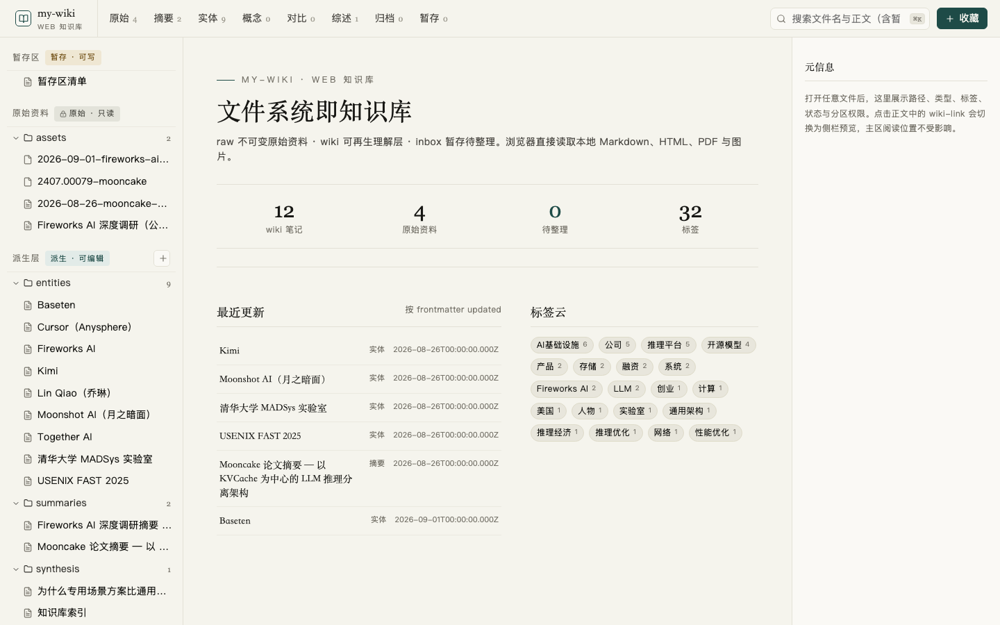
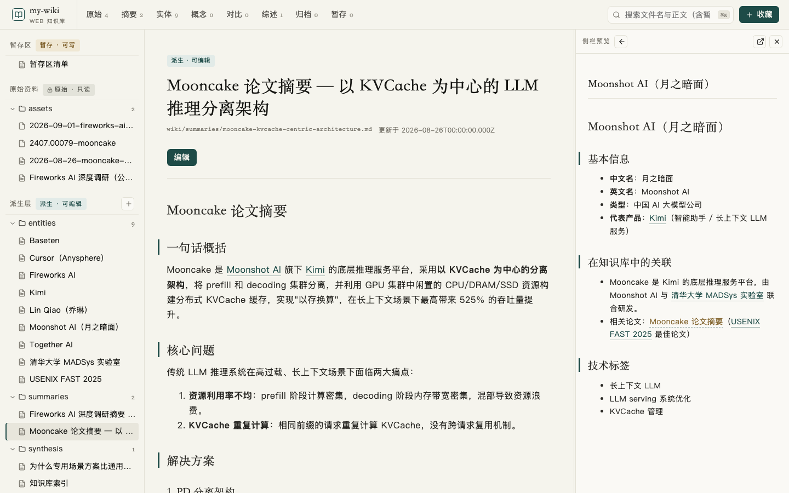

<div align="center">

# my-wiki

**一个由文件系统驱动、让 LLM 持续维护的本地优先个人知识库。**

纯 Markdown · Git 可追溯 · 无数据库 · 无向量存储 · 内置 Web 阅读与编辑端

[在线只读版](https://leoliulei.github.io/my-wiki/) · [快速开始](#快速开始) · [Web 查看端](#web-查看端) · [GitHub Pages](#github-pages) · [知识库工作流](#知识库工作流)

</div>



## 为什么是 my-wiki？

多数 AI 问答在会话结束后就散失了。my-wiki 把资料、摘要、实体、概念、对比和观点沉淀为普通文件，让每次收录与提问都能继续为下一次工作提供上下文。

它遵循三个简单原则：

- **人负责 sourcing，LLM 负责记账**：你负责找到值得保存的资料，Agent 负责抓取、摘要、交叉引用、归档与维护。
- **文件系统就是数据库**：所有知识都是可读、可编辑、可迁移、可 Git 版本控制的 Markdown 和原始附件。
- **原始证据与派生理解分层**：原件保持不可变，LLM 生成的理解层可以随新证据持续重建。

> 方法论源自 [Andrej Karpathy 的 LLM Wiki](https://gist.github.com/karpathy/442a6bf555914893e9891c11519de94f)，本项目进一步加入了 inbox 暂存工作流和 TypeScript 全栈 Web 查看端。

## 核心特性

| 能力 | 说明 |
| --- | --- |
| 本地优先 | 内容直接保存在仓库目录中，没有隐藏数据库和专有数据格式 |
| LLM 原生工作流 | 在 Claude Code、Cursor、OpenCode、豆包等可读写本地文件的 Agent 中直接用自然语言收录、查询和维护 |
| 三层知识模型 | `inbox/` 随手收藏，`raw/` 保存不可变证据，`wiki/` 承载可再生理解 |
| Web 阅读与编辑 | 浏览 Markdown、HTML、PDF、图片；支持全文搜索、分类导航、在线编辑和 wiki-link 侧栏预览 |
| 安全网址收藏 | 服务端逐跳校验 URL，拦截私网/环回地址，限制响应类型、大小、重定向和超时，并保存原始响应字节 |
| 可审计写入 | wiki 写操作记录到 `_log.md`；编辑采用版本校验、原子写入和冲突恢复 |
| 多工具兼容 | 可直接用 Obsidian、Foam、任意 Markdown 编辑器、Git 和命令行操作 |

## 快速开始

### 前置条件

- Git
- Node.js 20 或更高版本（仅 Web 查看端需要）
- 一个能够读写本地文件的 LLM CLI / Agent（建议但非必需）

### 1. 克隆知识库

```bash
git clone git@github.com:leoliulei/my-wiki.git
cd my-wiki
```

### 2. 启动 Web 查看端

仓库根目录提供了一键部署启动脚本，会检查 Node.js 版本、按锁文件安装依赖、完成生产构建并以前台方式启动服务：

```bash
./scripts/start-local.sh --open
```

默认访问 `http://127.0.0.1:4317`。不需要自动打开浏览器时省略 `--open`；依赖未变化的重复启动可使用 `--skip-install`，也可以通过 `--port 4318` 指定其他端口。

仍可手动执行：

```bash
cd web-viewer
npm ci
npm run build
npm start
```

服务默认只监听本机回环地址，不对局域网或公网暴露。

### 3. macOS 后台运行

使用 `launchd` 安装为当前用户的后台服务，登录后自动运行；无需 `sudo`：

```bash
./scripts/macos-service.sh install
```

安装过程会自动执行 `npm ci` 和生产构建，然后写入 `~/Library/LaunchAgents/io.github.leoliulei.my-wiki.plist`。常用管理命令：

```bash
./scripts/macos-service.sh status     # 查看安装、进程和 HTTP 健康状态
./scripts/macos-service.sh restart    # 重启服务
./scripts/macos-service.sh stop       # 停止，保留登录自启配置
./scripts/macos-service.sh start      # 再次启动
./scripts/macos-service.sh logs       # 持续查看标准输出和错误日志
./scripts/macos-service.sh uninstall  # 停止并删除 LaunchAgent 配置
```

自定义端口只需在安装时指定：

```bash
./scripts/macos-service.sh install --port 4318
```

服务日志保存在 `~/Library/Logs/my-wiki/`。代码或依赖更新后，再运行一次 `install` 即可重新构建并替换后台服务配置。

### 4. 开发模式

```bash
cd web-viewer
npm run dev
```

前端开发服务器运行在 `http://127.0.0.1:5173`，并将 `/api` 代理到本地 Express 服务。

## Web 查看端



Web 查看端并不复制知识库数据，而是直接扫描仓库中的 `inbox/`、`raw/` 和 `wiki/`：

- 首页展示统计、最近更新与标签云
- 顶栏按原始资料、摘要、实体、概念、对比、综述、归档和暂存分类
- 文件树展示三区目录，明确只读与可编辑权限
- 搜索覆盖文件名、路径与 Markdown 正文
- Markdown 支持 frontmatter、GFM 和 `[[wiki-link]]`
- 点击 wiki-link 在右侧预览关联页面，不打断主区阅读位置
- HTML 在无脚本沙箱中渲染；PDF 使用与页面风格一致的无外框阅读区
- wiki / inbox Markdown 支持即时渲染与源码双模式编辑、自动保存、图片附件和冲突恢复
- 收藏入口支持粘贴文本、上传文件和抓取公开 HTTP/HTTPS 网址
- 暂存项可复制 `收录 inbox/2026-09-06-某文章.md` 指令、标记归档或批量清理

详细需求与边界见 [`docs/web-viewer-prd.md`](docs/web-viewer-prd.md)。

## GitHub Pages

仓库包含 [`.github/workflows/pages.yml`](.github/workflows/pages.yml)，每次向 `main` 推送 Web 代码或知识库内容时，GitHub Actions 会自动构建并部署静态只读站点：

**https://leoliulei.github.io/my-wiki/**

静态模式与本地模式的边界：

| 本地完整模式 | GitHub Pages 模式 |
| --- | --- |
| 扫描本地 `inbox/`、`raw/`、`wiki/` | 只导出 Git 已追踪的 `raw/` 和 `wiki/` |
| 支持编辑、收藏、上传、归档和网址抓取 | 强制只读，不包含写接口和 Express 服务 |
| 可查看本机尚未提交的资料 | 不发布未提交文件，默认不发布 `inbox/` |
| `./scripts/start-local.sh` 或 `npm start` 启动 | 推送到 `main` 后由 Actions 自动部署 |

首次使用时，在 GitHub 仓库的 **Settings → Pages → Build and deployment → Source** 中选择 **GitHub Actions**。后续工作流会自动完成构建与发布。

本地预览 Pages 构建：

```bash
cd web-viewer
GITHUB_REPOSITORY=leoliulei/my-wiki npm run build:pages
mkdir -p pages-preview/my-wiki
cp -R dist/client/. pages-preview/my-wiki/
python -m http.server 4173 --directory pages-preview
```

然后访问 `http://127.0.0.1:4173/my-wiki/`，并可运行：

```bash
npm run test:pages
```

> GitHub Pages 是公开网站。进入 Git 历史的 `raw/` 与 `wiki/` 文件会被公开发布；不要提交密钥、个人隐私、公司内部资料或其他不应公开的内容。

## 知识库工作流

### 收录新资料

在仓库目录中对 Agent 说：

```text
收录 https://example.com/article
```

也可以直接提供 PDF 或文本。Agent 会按仓库规则完成：

```text
抓取 / 读取 → 保存 raw → 生成摘要 → 更新实体与概念 → 建立交叉引用 → 更新索引 → 写入日志
```

### 先收藏，稍后整理

在 Web 查看端点击“收藏”，或把文件放入 `inbox/`。准备整理时对 Agent 说：

```text
整理暂存区
```

也可以只收录某一项：

```text
收录 inbox/2026-09-06-某文章.md
```

Agent 会将资料正式写入 `raw/` 和 `wiki/`，随后把暂存项标记为 `archived`。归档项不会自动删除，避免误清理。

### 查询与综合

```text
这个知识库里关于 X 有哪些讨论？
A 和 B 的核心区别是什么？
基于现有资料总结 X 的共识、争议与证据缺口
```

Agent 先读取 `_index.md` 定位资料，再综合原始证据和派生页面。有复用价值的答案可以归档到 `wiki/synthesis/`。

### 健康检查

```text
lint wiki
```

该操作用于检查断链、孤立页面、矛盾描述和可能过时的内容。

## 三层数据模型

```text
inbox/  ──整理──▶  raw/  ──提炼──▶  wiki/
 可变草稿箱          不可变证据          可再生理解层
```

- **`inbox/`**：低成本收藏入口，可以编辑、改名、归档和删除。
- **`raw/`**：原始网页、文档、PDF、图片等可信快照；Web API 明确拒绝修改、重命名和删除。
- **`wiki/`**：摘要、实体、概念、对比、综述和观点；允许由人或 Agent 持续修订。

## 目录结构

```text
my-wiki/
├── AGENTS.md                 # Agent 通用入口（链接到 CLAUDE.md）
├── CLAUDE.md                 # 知识库摄取、查询、维护规则
├── README.md
├── docs/
│   ├── web-viewer-prd.md     # Web 查看端产品需求
│   └── images/               # README 产品截图
├── inbox/
│   ├── _inbox.md             # 非 Markdown 暂存项的来源与状态清单
│   └── files/                # 暂存 PDF、HTML、图片等原件
├── raw/
│   ├── YYYY-MM-DD-标题.md
│   └── assets/               # 原始附件
├── wiki/
│   ├── summaries/            # 单篇资料摘要
│   ├── entities/             # 人物、组织、产品与技术
│   ├── concepts/             # 方法论、架构模式与理论
│   ├── comparisons/          # 横向对比
│   ├── overviews/            # 主题综述
│   ├── synthesis/            # 问答与观点归档
│   ├── _index.md             # 全库索引
│   └── _log.md               # 操作日志
├── scripts/
│   ├── start-local.sh        # 一键安装、构建和前台启动
│   └── macos-service.sh      # macOS launchd 后台服务管理
└── web-viewer/
    ├── client/               # React + Vite 前端
    ├── server/               # Express 文件系统 API
    ├── smoke.ts              # 浏览器烟测与截图脚本
    └── package.json
```

## 技术架构

```text
Browser
   │
   ├── React + Vite + TypeScript
   │      ├── Markdown / wiki-link 阅读
   │      ├── Tiptap 编辑器
   │      └── 搜索、分类、暂存工作流
   │
   └── Express + TypeScript（127.0.0.1:4317）
          ├── 扫描 inbox / raw / wiki
          ├── 原子写入与乐观锁
          ├── HTML / PDF / 图片读取
          └── URL 抓取安全边界
                    │
                    ▼
              本地文件系统 + Git
```

Web 查看端没有数据库。关闭服务后，所有可持久化状态仍然是仓库中的文件；仅编辑草稿和预览宽度会临时保存在浏览器本地存储中。

## 安全边界

- 服务绑定 `127.0.0.1`，定位为个人本机工具，而非多人在线服务
- 路径必须位于 `inbox/`、`raw/` 或 `wiki/`，拒绝目录穿越
- `raw/` 的编辑、重命名与删除在界面和 API 两层同时禁用
- 写接口需要启动时生成的会话令牌
- HTML 使用空权限 sandbox，不执行脚本、表单或顶层导航
- URL 抓取只接受 HTTP/HTTPS，逐跳重新解析 DNS 并拒绝私网、环回、链路本地和保留地址
- 下载默认限制为 50 MB、最多 5 次重定向，并设置连接/响应超时
- 写文件使用临时文件 + 原子替换；Markdown 编辑通过版本号检测外部修改

> 当前版本没有用户账户和权限系统。不要把服务直接暴露到公网；若未来需要多人协作，应增加独立认证、授权、审计和隔离层。

## 开发与验证

所有 Web 端命令都在 `web-viewer/` 目录执行：

```bash
npm run dev        # 同时启动前后端开发服务
npm run typecheck  # TypeScript 严格检查
npm test           # 文件系统安全边界单元测试
npm run build      # 生产构建 + 类型检查
npm run test:ui    # 本地完整模式浏览器烟测并更新 README 截图
npm run build:pages # 导出 Git 已追踪内容并生成 Pages 静态站点
npm run test:pages # 验证 /my-wiki/ 子路径下的静态只读模式
npm start          # 启动生产构建并打开浏览器
npm run start:server # 启动生产服务但不打开浏览器（后台服务使用）
```

完整交付前建议执行：

```bash
npm run build && npm test && npm run test:ui
```

`npm run test:ui` 需要先启动生产服务，并在本机安装 Playwright Chromium：

```bash
npx playwright install chromium
npm start
# 另开终端
npm run test:ui
```

## 使用其他工具浏览

- **Obsidian**：将仓库根目录作为 Vault 打开，可识别 `[[wiki-link]]` 并展示关系图谱。
- **VS Code + Foam**：适合在 IDE 中浏览和维护。
- **任意 Markdown 编辑器**：没有专有格式依赖。
- **命令行**：例如 `grep -r "\[\[" wiki/` 可快速检查 wiki-link。

## 项目状态

这是一个面向个人工作流的本地知识库，当前重点是：

1. 保持文件格式长期可读和工具无关
2. 让收藏、整理、阅读和修订形成完整闭环
3. 守住 `raw` 不可变、`wiki` 可再生的知识边界

欢迎通过 Issue 或 Pull Request 讨论缺陷和改进。仓库目前未声明开源许可证；在许可证补充前，请不要假设代码或内容可以被自由再分发。

## 致谢

- [Andrej Karpathy：LLM Wiki 方法论](https://gist.github.com/karpathy/442a6bf555914893e9891c11519de94f)
- [Obsidian](https://obsidian.md/) 与 [Foam](https://foambubble.github.io/foam/) 对 Markdown / wiki-link 工作流的长期探索
