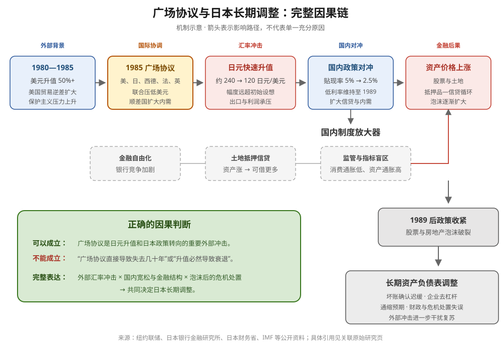

# 广场协议

## 定义

广场协议（Plaza Accord）是 [[五国集团]] 的财政部长与中央银行行长于 1985 年 9 月 22 日在纽约广场饭店达成的国际政策协调安排。核心方向是五国联合推动当时被认为高估的美元有序贬值，使日元、德国马克等非美元货币升值，并要求主要顺差国扩大内需，以缓解美国贸易逆差和全球国际收支失衡。

它不是日本单独签署的“固定升值协议”，也不是美国单方面设定日元目标价，而是五国共同改变汇率与宏观政策方向。

## 背景

- 1980 年初至 1985 年初，美元对主要货币加权升值超过 50%。
- 强美元削弱美国制造业竞争力，贸易和经常账户逆差扩大，保护主义压力上升。
- 日本和西德是主要顺差国，被期待通过本币升值与扩大内需共同承担调整。

## 协议内容

1. 五国在外汇市场加强协调与干预，推动非美元货币“有序升值”。
2. 美国改变此前较少干预美元汇率的政策立场。
3. 日本、西德等顺差经济体扩大国内需求，降低对出口的依赖。
4. 各国通过货币、财政和结构政策共同纠正国际失衡。

## 汇率结果

- 协议前：约 1 美元兑 240 日元。
- 内部讨论的非美元货币升值目标约 10%—12%，但市场走势远超初始目标。
- 1985 年底接近 200；1987 年初跌破 150；1988 年初约为 120 日元/美元。
- 日元快速升值压缩日本出口企业的日元收入，并提高其商品的外币售价。

## 对日本经济的传导

[[日本银行]] 为缓冲日元升值和出口减速，自 1986 年起连续降低官方贴现率，从 5% 降至 1987 年 2 月的 2.5%，并将低利率维持至 1989 年 5 月。低利率与金融自由化、银行竞争、土地抵押信贷和监管不足共同推动股票与土地泡沫。

泡沫破裂后，银行坏账、企业去杠杆、资产负债表修复、通缩预期及政策处置迟缓共同造成长期低迷。因此，广场协议是重要外部冲击与政策转折点，但不是“失去的几十年”的单一充分原因。

## 常见误解

### 误解一：广场协议是日本的“投降协议”

事实：协议由五国共同签署，日本确实承受美国贸易和政治压力，但也有缓解保护主义、维持国际协调和推动经济结构转型的自身动机。

### 误解二：协议规定日元必须升值到 120

事实：内部讨论的初始目标约为 10%—12%；随后市场形成强烈单边预期，实际升值远超初始设想。

### 误解三：协议直接导致日本长期衰退

事实：完整因果链还包括日本国内长期宽松、金融自由化与监管不足、资产泡沫、政策收紧，以及泡沫破裂后的坏账与通缩处置。

### 误解四：货币升值一定导致衰退

事实：升值效果取决于速度、生产率、财政支持、居民消费、金融监管和危机处置；IMF 的结论是货币升值不必然造成“失去的几十年”。

## 对中国汇率讨论的启示

参见 [[从广场协议看人民币升值的真正风险]]。核心不是“人民币能不能升值”，而是：

- 升值速度是否可控；
- 企业能否通过生产率与产业升级消化冲击；
- 是否用长期低利率和房地产信贷对冲出口压力；
- 是否同步提高居民收入与消费；
- 金融监管和银行坏账处置是否足够及时。

## 主要来源

- [纽约联储：1985 年外汇市场干预记录](https://www.newyorkfed.org/medialibrary/media/research/quarterly_review/1985v10/v10n4article9.pdf)
- [波士顿联储：外汇干预与货币政策信号](https://www.bostonfed.org/-/media/Documents/neer/neer391c.pdf)
- [日本银行金融研究所：日本资产泡沫与货币政策](https://www.imes.boj.or.jp/research/papers/english/00-E-12.pdf)
- [日本财务省：广场协议后的货币金融政策](https://www.mof.go.jp/english/pri/publication/policy_1972-1990/Chapter3-2.pdf)
- [IMF：广场协议是否导致日本失去的几十年](https://www.imf.org/en/-/media/websites/imf/imported-flagship-issues/external/pubs/ft/weo/2011/01/c1/_box14pdf.pdf)

## 相关页面

- [[五国集团]]
- [[日本银行]]
- [[人民币渐进升值框架]]
- [[从广场协议看人民币升值的真正风险]]
- [[中国宏观]]
