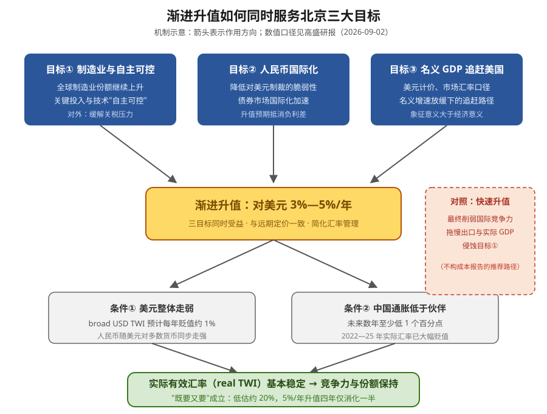

# 人民币渐进升值框架

## 定义

高盛提出的关于人民币对美元长期路径的政策分析框架：北京通过让人民币对美元**每年渐进升值约 3%—5%**，在不大幅损害出口竞争力的前提下，同时服务"制造业升级与自主可控、人民币国际化、名义 GDP 追赶美国"三大目标。这是政策推演/最可能路径，不是政策承诺。

## 起源与演进

- 源自高盛 "China in the long run" 系列对北京多目标权衡的推演，首次进入本库见于 [[China：Three things in China 报告分析]]（2026-09-06）的引用。
- 完整论证见 [[Asia in Focus：为什么北京可能偏好人民币渐进升值]]（2026-09-02）：三目标机制、低估测算、使能条件与预测路径。
- 实际节奏由每日中间价、逆周期因子等信号体现：2025 末—2026 中快速升值后，近期中间价指向放慢——与渐进框架一致。

## 机制

两个使能条件使"对美元升值但不损竞争力"成立：

1. **美元整体走弱**：broad USD TWI 预计每年贬值约 1%（美元相对人民币与北亚货币高估）。
2. **中国通胀差**：中国通胀预计至少低于贸易伙伴 1 个百分点（2022—25 年实际汇率已大幅贬值）。

缓冲：人民币低估约 20%；5%/年对美元升值 ≈ 2.5%/年 real TWI 升值，四年仅消化一半低估。

## 应用场景

- 解释北京汇率政策取向与中间价信号（快速升值后的主动放缓）。
- 评估人民币资产吸引力：升值预期抵消中美负利差（10 年期美债高出中债 300bp+），支撑债券市场国际化。
- 判断 USDCNY 长期路径：报告预测 2028 年底约 6.0、2031 年底约 5.50。
- 亚洲货币联动：人民币走强对亚洲其他货币有支撑。

## 争议与替代

- **IMF 视角**：汇率作用被夸大，结构性调整与美国财政整固优先。高盛回应：汇率调整必要但不充分，需配合中国财政扩张。
- **更优但更难执行的方案**：更快升值 + 居民消费刺激（福利与再平衡意义上更优；2005—15 年制造业份额在升值中仍增长，得益于 WTO 红利），但北京推进谨慎。
- **中断风险**：大规模关税战再起或全球衰退会削弱出口动能，改变升值路径。
- **历史参照**：[[广场协议]] 后日元快速升值并不直接等于日本长期衰退；真正的风险链是快速升值后用长期低利率、房地产和银行信贷对冲增长，最终形成资产泡沫。详见 [[从广场协议看人民币升值的真正风险]]。

## 相关页面

- [[Asia in Focus：为什么北京可能偏好人民币渐进升值]]（完整论证）
- [[China：Three things in China 报告分析]]（首次引用）
- 作者与机构：[[Andrew Tilton]]、[[Hui Shan]]、[[Goldman Sachs]]
- 政策主体：[[中国人民银行]]
- 历史参照：[[广场协议]]、[[日本银行]]
- 观点归档：[[从广场协议看人民币升值的真正风险]]
- 主题：[[中国宏观]]
