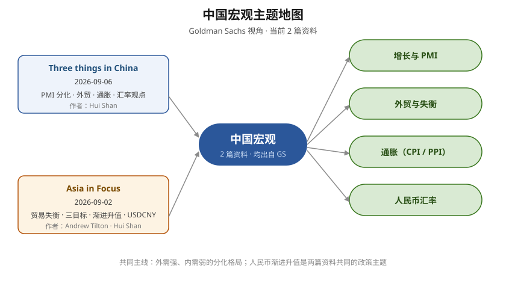

# 中国宏观（主题综述）

## 主题现状

当前 2 篇中国宏观主资料，均出自 [[Goldman Sachs]] Global Investment Research；另加入 1 篇历史比较研究作为人民币升值路径的风险参照。

| 资料 | 日期 | 覆盖主题 |
|---|---|---|
| [[China：Three things in China 报告分析]] | 2026-09-06 | PMI 分化、外贸与通胀预测、人民币长期观点 |
| [[Asia in Focus：为什么北京可能偏好人民币渐进升值]] | 2026-09-02 | 贸易失衡、三大目标、渐进升值框架、USDCNY 预测 |
| [[广场协议]] | 1985 / 2026-09-09 收录 | 日元急升、国内政策对冲、资产泡沫与中日差异 |

## 主题地图

## 已覆盖与未覆盖

- **已覆盖**：官方 PMI（增长节奏与分化）、贸易（顺差规模与前瞻）、通胀（CPI/PPI 预测、通胀差）、人民币（长期升值框架与短期信号）、历史风险参照（[[广场协议]] 与日本泡沫经验）。
- **未覆盖**：财政/货币政策的量化细节、资本流动数据、分行业/品类贸易拆分、官方 GDP 口径讨论。
- **共同主线**：两篇高盛资料都指向"外需强、内需弱"的分化格局；人民币渐进升值（[[人民币渐进升值框架]]）是共同政策主题。日本案例表明，真正风险不是升值本身，而是升值速度、国内刺激方式与金融损失处置。

## 历史比较：为什么不能机械套用日本案例

[[广场协议]] 是 1985 年 G5 明确协调压低美元的国际安排，随后日元在约三年内从 240 升至 120 日元/美元；而当前材料讨论的是人民币每年 3%—5% 的渐进路径，且中国的资本流动管理、金融结构和产业链位置均不同。比较价值主要在政策机制：若用长期低利率和房地产信贷替代出口增长，汇率调整可能被转化为资产泡沫。详见 [[从广场协议看人民币升值的真正风险]]。

## 下一步

- 官方 8 月贸易/CPI/PPI 数据发布后，更新验证 [[China：Three things in China 报告分析]] 的预测。
- 2026-09-24 中美领导人会晤后观察汇率信号，验证 [[Asia in Focus：为什么北京可能偏好人民币渐进升值]] 的路径假设。
