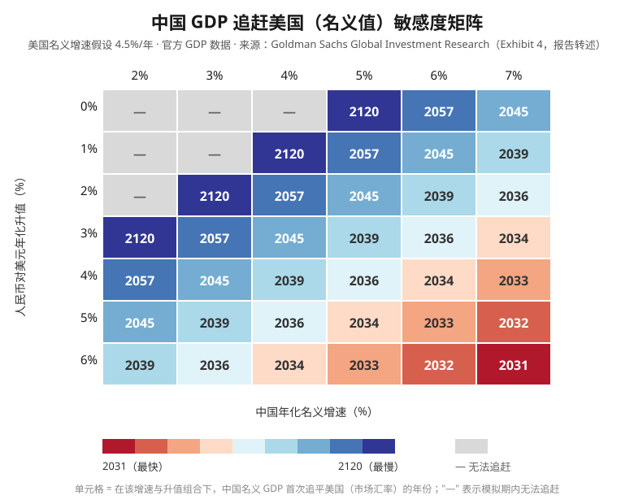

# Asia in Focus：为什么北京可能偏好人民币渐进升值

## 一句话概括

[[Goldman Sachs]] 中国宏观团队（[[Andrew Tilton]]、[[Hui Shan]]）的这份研报认为：面对不断扩大的贸易顺差和外部压力，北京的多目标权衡（制造业份额与自主可控、人民币国际化、名义 GDP 追赶美国）决定了它最可能选择对美元**每年渐进升值 3%—5%** 的路径；在美元整体走弱和中国低通胀两个条件下，这一速度不会损害以实际有效汇率衡量的竞争力。报告预测 USDCNY 在 2028 年底约 6.0、2031 年底约 5.50。

## 核心判断

1. **顺差规模引发外部压力，但再平衡不在北京议程前列。** 中国货物贸易顺差已达 GDP 的 6%、全球 GDP 的 1% 以上；美国以全面关税回应，欧盟更有选择性。高盛判断北京的政策偏好是"尽可能利用外需拉动增长"——外需强劲时国内宏观政策反而收紧。
2. **渐进升值能同时服务三大目标。** ① 释放照顾外部关切的信号、降低关税反击概率；② 升值预期抵消中美负利差、提升人民币资产吸引力；③ 帮助以美元计价的名义 GDP 追赶美国。快速升值会侵蚀目标①，但每年 3%—5% 的渐进升值影响很小。
3. **"既要又要"的前提是实际有效汇率（real TWI）不升值。** 两个使能条件：美元 broad TWI 预计每年走弱约 1%；中国通胀预计至少低于贸易伙伴 1 个百分点。两者意味着人民币对美元升值 2—3%/年也可维持 real TWI 数年不变。
4. **人民币低估约 20% 提供了缓冲。** 即使每年对美元升值 5%（≈ real TWI 年升值 2.5%），四年后也只消化一半低估，"五年后仍明显低于公允价值"。
5. **汇率在很大程度上是政策变量。** 每日中间价（含逆周期因子）、央行沟通、大规模干预资源与长期资本管制（Stock/Bond Connect 等授权渠道）决定了 CNY 的长期路径。

## 分析路径：三目标权衡与两个使能条件

## 关键数据：追赶时间表敏感度矩阵

> 口径：美国名义增速假设 4.5%/年，使用官方 GDP 数据（Exhibit 4 转述）；"—" 表示模拟期内无法追赶。矩阵显示：没有人民币升值时，中国名义 GDP 追赶美国要么遥遥无期（低增速），要么迟至 2045 年之后；升值越快、增速越高，追赶越早。

## 关键数据与口径

| 指标 | 数值 | 口径 |
|---|---:|---|
| 货物贸易顺差 | 约 GDP 的 6%，全球 GDP 的 1%+ | 报告原文 |
| 人民币低估幅度 | 约 20%（可能更大） | 高盛评估 |
| 10 年期中债收益率 | 1.7%（5 年期约 1.4%） | 报告原文 |
| 中美 10 年期利差 | 美债高出 300bp+ | 报告原文 |
| 美元 broad TWI 年化贬值 | 约 1% | 高盛全球汇率预测 |
| 中国通胀低于贸易伙伴 | ≥1 个百分点（未来数年） | 高盛预测 |
| 建议升值速度 | 对美元 3—5%/年 | 政策推演，非承诺 |
| USDCNY 预测 | 2028 年底约 6.0；2031 年底约 5.50 | 高盛预测 |

## 深层分析

### 1. 这是上一份报告的完整展开

2026-09-06 的 [[China：Three things in China 报告分析]] 引用了高盛"China in the long run"系列的人民币渐进升值判断；本报告（2026-09-02）正是该框架的完整论证——三目标机制、低估测算、利差与国际化逻辑、追赶矩阵与预测路径。两篇共同构成当前"中国宏观"主题的核心资料。

### 2. 顺差与再平衡的辩论格局

IMF 高层淡化汇率作用、主张结构性调整与美国财政整固；高盛认为汇率调整"必要但不充分"，需配合中国财政扩张刺激内需、高赤字经济体财政克制。中国官方表态"从未刻意追求贸易顺差"，但制造业全面强化与"自主可控"的目标在数学上难以与顺差收缩兼容——这是报告判断北京会继续利用外需的根据。

### 3. 国际化逻辑依赖升值预期

中债收益率长期下行（10 年期 1.7%）而美债高出 300bp+；单纯看利差，人民币资产缺乏吸引力。若市场形成持续升值预期，升值收益可抵消负利差——这是近年债券市场国际化动作（报告指出的"过去一年加大力度"）背后的逻辑。

### 4. 政策证据：快速升值后主动放缓

2025-10-30 特朗普-习会晤（首尔）后人民币快速升值（年化一度 6.9%）；2026-01-15 央行释放容忍走强信号；2026-05-14/15 北京会晤后升速降至年化 3.2%。近期中间价逆周期因子显示北京倾向放慢节奏——与"渐进"框架一致，而非追求一次性重估。

### 5. 替代方案被讨论但推进谨慎

更快升值 + 消费刺激在居民福利与全球再平衡意义上更优（2005—15 年制造业份额在升值中仍增长，得益于强竞争力与 WTO 红利）；但北京对居民支持政策推进谨慎，促消费五年规划实施缓慢。

## 证据强度与局限

- **方向性证据**：三目标机制、低估幅度、利差与国际化逻辑、Exhibit 4 追赶矩阵。
- **机构预测**：美元走弱速度、通胀差、USDCNY 路径（6.0 / 5.50）。
- **观点 / 假设**："渐进升值最符合北京偏好"是对政策行为的推断，不是政策承诺；"汇率是政策变量"的判断依赖对央行行为的解读。
- **资料局限**：报告未展示模型参数、干预细节与资本流动数据；逆周期因子解读属间接推断。
- **版权边界**：原 PDF 为高盛客户研究，仅供个人使用；知识库保留本地原件和转述分析，不对外发布报告全文。

## 相关实体与主题

- **发布机构**：[[Goldman Sachs]]
- **作者**：[[Andrew Tilton]]、[[Hui Shan]]
- **政策主体**：[[中国人民银行]]（PBOC，与 SAFE 共同管理汇率）
- **外部压力方**：[[Scott Bessent]]（美国财政部长）、IMF
- **概念**：[[人民币渐进升值框架]]
- **主题**：[[中国宏观]]（已达 2 篇资料，建立综述页）

## 后续验证指标

1. 2026-09-24 习近平访美会见特朗普后，中间价与逆周期因子是否继续指向渐进升值。
2. USDCNY 是否按报告路径走向 2028 年底 6.0 附近；升值是否伴随人民币资产国际持有量上升。
3. 美国就业报告与 9 月美联储会议对美元走势的影响。
4. 若关税战再起或全球衰退，出口动能与升值路径将如何修正。
