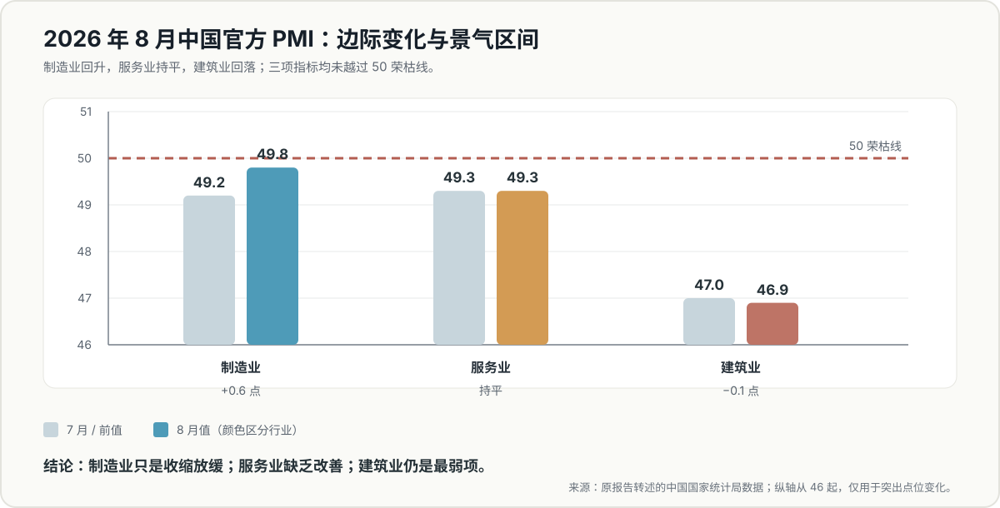
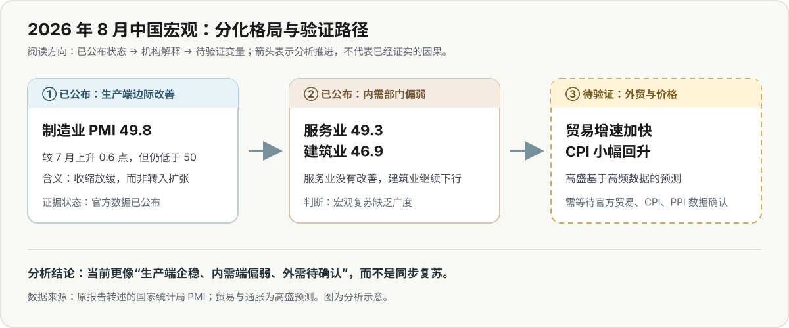

# China：Three things in China 报告分析

## 一句话概括

[[Goldman Sachs]] 经济学家 [[Hui Shan]] 的这份短报呈现的是**结构性分化，而非全面复苏**：2026 年 8 月制造业 PMI 明显回升，但仍未越过 50 荣枯线；服务业停滞、建筑业继续收缩。报告同时提出人民币渐进升值的长期政策推演，并预测 8 月外贸增速改善、通胀小幅回升，但后两项在报告发布时仍待官方数据验证。

## 核心判断

1. **制造业边际改善，不等于已经扩张。** 官方制造业 PMI 从 49.2 回升至 49.8，意味着收缩速度放缓；报告中的“strong manufacturing”应理解为相对于服务业和建筑业更强，而非绝对景气。
2. **内需相关部门仍弱，复苏缺乏广度。** 服务业 PMI 维持 49.3，建筑业 PMI 从 47.0 降至 46.9。三项 PMI 均低于 50，说明改善尚未跨行业扩散。
3. **外贸与通胀部分是前瞻预测。** 出口 26.0%、进口 32.6%、CPI 0.7%、PPI 3.5% 均为数据发布前的高盛预测，不能与已经公布的 PMI 等量齐观。
4. **人民币渐进升值属于政策框架，不是短期汇率预测。** 每年升值 3%—5% 是高盛对多目标政策权衡的推演，不代表政策承诺或确定路径。

## PMI 对比：边际改善与景气区间

> 数据口径：制造业、服务业和建筑业 PMI 均为原报告转述的 [[中国国家统计局]] 数据。纵轴从 46 起以突出点位差异，不能据此比较绝对规模。

## 分析路径：从已公布状态到待验证变量

> 图为分析示意。PMI 为已公布数据；贸易与通胀为高盛预测。箭头表示分析推进，不代表已经证实的因果关系。

## 关键数据与口径

| 指标 | 7 月 / 前值 | 8 月值 / 预测值 | 变化 | 数据性质 |
|---|---:|---:|---:|---|
| 官方制造业 PMI | 49.2 | 49.8 | +0.6 点 | 已公布 |
| 官方服务业 PMI | 49.3 | 49.3 | 0 | 已公布 |
| 官方建筑业 PMI | 47.0 | 46.9 | −0.1 点 | 已公布 |
| 出口同比 | 23.9% | 26.0% | +2.1 个百分点 | 高盛预测 |
| 进口同比 | 27.5% | 32.6% | +5.1 个百分点 | 高盛预测 |
| CPI 同比 | 0.5% | 0.7% | +0.2 个百分点 | 高盛预测 |
| PPI 同比 | 3.5% | 3.5% | 0 | 高盛预测 |

## 深层分析

### 1. 制造业的信号是“企稳”，不是“扩张”

制造业 PMI 单月回升 0.6 点，是三项指标中唯一明显改善的部分，但 49.8 仍处于收缩区间。更稳妥的判断是生产端边际企稳，而不是制造业周期已经反转；是否形成趋势，需要观察后续能否连续站上 50。

### 2. 服务业和建筑业限制了复苏广度

服务业没有改善，建筑业继续下行，说明工业端的边际好转尚未传导至更广泛的内需部门。建筑业 46.9 可能与地产链、基建和固定资产投资需求有关，但原报告没有提供销售、开工或投资分项，不能据此锁定单一原因。

### 3. 贸易预测若兑现，首先验证的是外需，而非内需

报告依据高频航运和韩国贸易数据，预计出口与进口同比增速都将上升。出口改善可以与制造业企稳相互印证；进口上升却可能由内需、加工贸易投入品、价格变化或低基数共同造成。缺少数量、价格、国别和品类拆分时，不能把进口增速直接等同于国内需求反转。

### 4. 通胀预测更接近温和修复

CPI 预测仅从 0.5% 升至 0.7%，且报告称其预测低于市场一致预期；PPI 预计维持 3.5%。即使预测兑现，也更像价格压力温和修复，而非总需求过热，仍需结合核心 CPI、食品能源、工业品分项和环比变化判断。

### 5. 人民币升值框架服务于长期多目标权衡

高盛认为，从北京的政策视角看，人民币对美元每年渐进升值 3%—5%，可能有助于中国以美元计价的名义 GDP 追赶美国，同时平衡出口竞争力、国内金融条件和资本流动。由于本报告未展开模型、约束条件与反例，这一结论只能作为待深入研究的分析框架。

## 证据强度与局限

- **较强证据**：三项官方 PMI 及其环比变化，来源为原报告转述的 [[中国国家统计局]] 数据。
- **方向性证据**：高频航运与韩国贸易数据对中国进出口的领先提示；原报告未展示底层序列、模型和误差范围。
- **机构预测**：出口、进口、CPI 和 PPI 的 8 月数值，在报告发布时尚未由官方数据验证。
- **观点 / 假设**：人民币每年升值 3%—5% 的政策最优性判断。
- **资料局限**：研究正文只有一页，缺少 PMI 分项、季调细节、历史分位、贸易品类和通胀分项，不足以完成完整的宏观归因。
- **版权边界**：原 PDF 为高盛客户研究，仅供个人使用；知识库保留本地原件和转述分析，不对外发布报告全文。

## 相关实体与主题

- **发布机构**：[[Goldman Sachs]]
- **作者**：[[Hui Shan]]
- **数据来源**：[[中国国家统计局]]
- **主题状态**：本报告开启“中国宏观”主题；2026-09-08 收录 [[Asia in Focus：为什么北京可能偏好人民币渐进升值]] 后已达 2 篇资料，建立概念页 [[人民币渐进升值框架]] 与综述页 [[中国宏观]]。

## 后续验证指标

1. 官方 8 月出口、进口同比是否接近 26.0% 和 32.6%，偏差来自哪些品类、价格和基数因素。
2. CPI、PPI 是否分别达到 0.7% 和 3.5%，核心 CPI 与环比数据是否支持“温和再通胀”。
3. 制造业 PMI 后续能否连续站上 50，而不是单月反弹。
4. 服务业和建筑业能否同步改善，以确认复苏广度扩大。
5. 人民币长期升值框架的完整论证已由 [[Asia in Focus：为什么北京可能偏好人民币渐进升值]] 补齐（2026-09-08 收录），该条验证指标已闭环。
