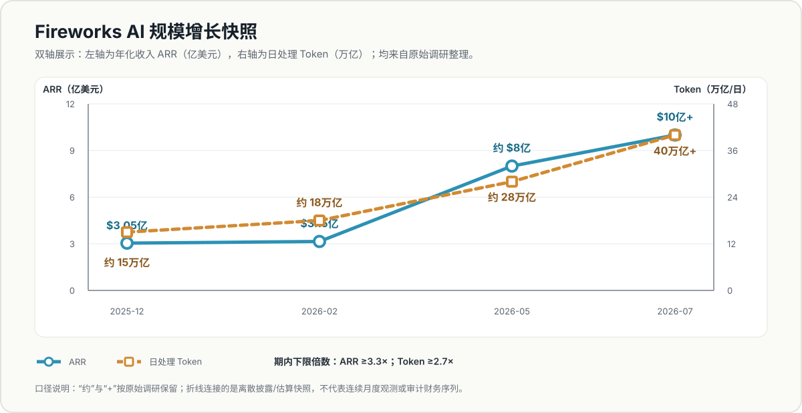
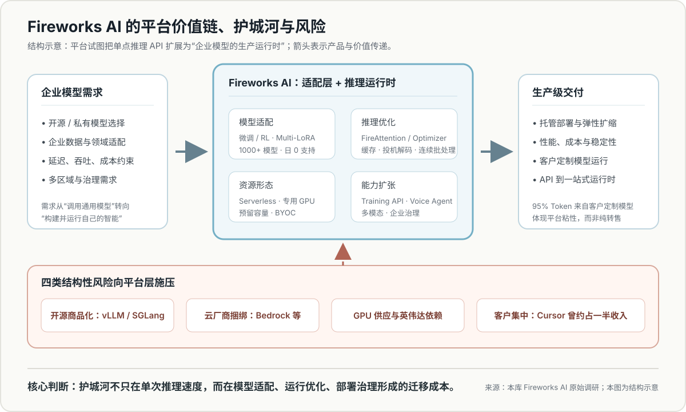

# Fireworks AI 深度调研摘要

## 一句话概括

[[Fireworks AI]] 是由前 Meta PyTorch 团队成员创办的开源模型推理平台。原调研显示，公司在 2025 年末至 2026 年 7 月间，ARR 从约 3.05 亿美元增至 10 亿美元以上，日处理 Token 从约 15 万亿增至 40 万亿以上；其核心价值并非简单转售 GPU，而是通过模型适配、推理优化与企业部署能力，把单点推理 API 扩展为生产级 AI 运行时。

## 核心判断

1. **增长与估值同时跃升，但估值兑现要求很高。** 原调研记录 Fireworks AI 于 2026 年 7 月完成 15.05 亿美元 D 轮融资，投后估值 175 亿美元；同期 ARR 超过 10 亿美元。按 10 亿美元的 ARR 下限计算，估值倍数不高于约 17.5 倍，意味着后续仍需持续证明高增长、客户分散和毛利改善。
2. **护城河来自“适配层 + 运行时”，不只来自推理速度。** FireAttention、FireOptimizer、缓存、投机解码和连续批处理负责性能优化；Multi-LoRA、微调/RL、专用容量、BYOC 和多区域能力则把客户模型、数据和部署流程绑定在平台上。
3. **企业定制模型是平台粘性的关键证据。** 原调研称 95% 的 Token 来自客户定制模型，说明需求重心可能正从调用通用模型，转向构建和运行企业自己的模型系统。
4. **主要风险是平台层被上下夹击。** 下层有 GPU 供应与英伟达依赖，上层有 AWS、Google、Microsoft 等云厂商捆绑；同时 vLLM、SGLang 等开源框架持续压缩专有推理引擎的差异化，[[Cursor]] 的历史收入占比还暴露出客户集中风险。

## 增长趋势：ARR 与日处理 Token

> 数据口径：图中“约”和“+”沿用原始调研。折线连接的是离散披露或估算快照，并非连续月度观测，也不等同于审计财务数据。按端点下限计算，ARR 至少增长约 3.3 倍，日处理 Token 至少增长约 2.7 倍。

## 平台架构：价值如何形成

> 图为结构示意。箭头表示产品与价值传递关系，不代表各能力之间存在已量化的因果贡献。

## 关键数据

| 指标 | 原调研记录 | 解读 |
|---|---:|---|
| D 轮融资 | 15.05 亿美元 | 资本支持其继续扩充算力、产品和区域覆盖 |
| 投后估值 | 175 亿美元 | 按 10 亿美元 ARR 下限计算，倍数不高于约 17.5 倍 |
| ARR | 10 亿美元以上（2026-07） | 较 2025 年末约 3.05 亿美元明显增长 |
| 日处理 Token | 40 万亿以上（2026-07） | 较 2025 年末约 15 万亿显著提升 |
| 定制模型占比 | 95% Token | 支撑“专业化智能”和适配层粘性叙事 |
| 企业客户 | 10,000+（原调研记录为 2025-11） | 客户规模口径与 2026-07 财务指标并非同一时点 |
| 毛利率 | 约 50%，目标 60% | 是商业质量和估值兑现的关键指标 |
| 累计融资 | 约 18 亿美元 | 业务仍具有明显资本密集属性 |

## 产品与商业模式

Fireworks AI 位于“闭源模型 API”和“企业自建 GPU 集群”之间，按客户控制力和资源保障程度提供多层产品：

1. **Serverless 推理**：按 Token 付费，降低模型试用和上线门槛。
2. **On-Demand 专用 GPU**：按 GPU 时间计费，提供更稳定的性能隔离。
3. **企业预留容量 / BYOC**：面向容量保障、区域部署和治理要求。
4. **模型适配**：微调、强化学习微调、Multi-LoRA，让同一基座承载大量企业适配器。
5. **能力扩张**：Training API 与 Voice Agent 将平台从推理执行层延伸至更完整的模型生命周期。

## 竞争格局

| 压力来源 | 代表玩家或方式 | 对 Fireworks AI 的影响 |
|---|---|---|
| 托管开源平台 | [[Together AI]]、[[Baseten]] 等 | 在模型覆盖、性能、价格和企业部署上直接竞争 |
| 垂直硬件 | Groq、Cerebras、SambaNova | 通过专用芯片压低延迟或成本 |
| 云厂商捆绑 | AWS Bedrock、Google Vertex、Azure Foundry | 利用既有云合同、数据与治理体系降低客户迁移意愿 |
| 开源商品化 | vLLM、SGLang、TensorRT、NVIDIA NIM | 降低企业自建门槛，压缩专有引擎溢价 |
| 供应与集中度 | GPU 供应、[[Cursor]] 客户集中 | 影响成本控制、议价权和收入稳定性 |

## 证据强度与局限

- **相对直接的证据**：融资轮次、产品能力、官方客户案例和平台披露的 Token 指标。
- **第三方估算**：部分 ARR、增速、估值倍数、市场规模与毛利率来自第三方研究或媒体口径，并非完整审计数据。
- **需要谨慎的推断**：“推理层即 AI 价值层”“专业化智能”等属于战略叙事；95% 定制模型 Token 支持该方向，但不能单独证明长期护城河。
- **资料局限**：原始资料是多来源调研汇编，各指标的统计时间、客户定义和收入确认口径未完全统一，趋势可参考，精确横比需回到一手披露。

## 与现有知识库的关联

- 与 Mooncake/KVCache 资料同属“推理基础设施”，但分析层次不同：[[Mooncake 论文摘要 — 以 KVCache 为中心的 LLM 推理分离架构]]解释底层系统如何通过分离架构和 KVCache 提高吞吐；Fireworks AI 则展示这些优化能力如何被封装为企业服务并形成商业价值。
- 与“专用场景方案”观点一致：Fireworks AI 通过针对模型、硬件和客户工作负载做专门优化，以复杂度换取性能和成本优势。

## 后续观察指标

1. 毛利率能否从约 50% 接近 60% 目标。
2. [[Cursor]] 收入占比是否持续下降，前五大客户集中度是否改善。
3. ARR 与 Token 增长能否继续同步，避免“使用量增长但单位经济性恶化”。
4. Training API、Voice Agent 和 Multi-LoRA 是否带来独立收入与更高留存。
5. 与 [[Together AI]]、[[Baseten]] 及云厂商在价格、延迟、模型覆盖和企业部署上的差异是否扩大。
6. 英伟达强化推理云布局后，Fireworks AI 的 GPU 成本和供应议价能力是否受压。
