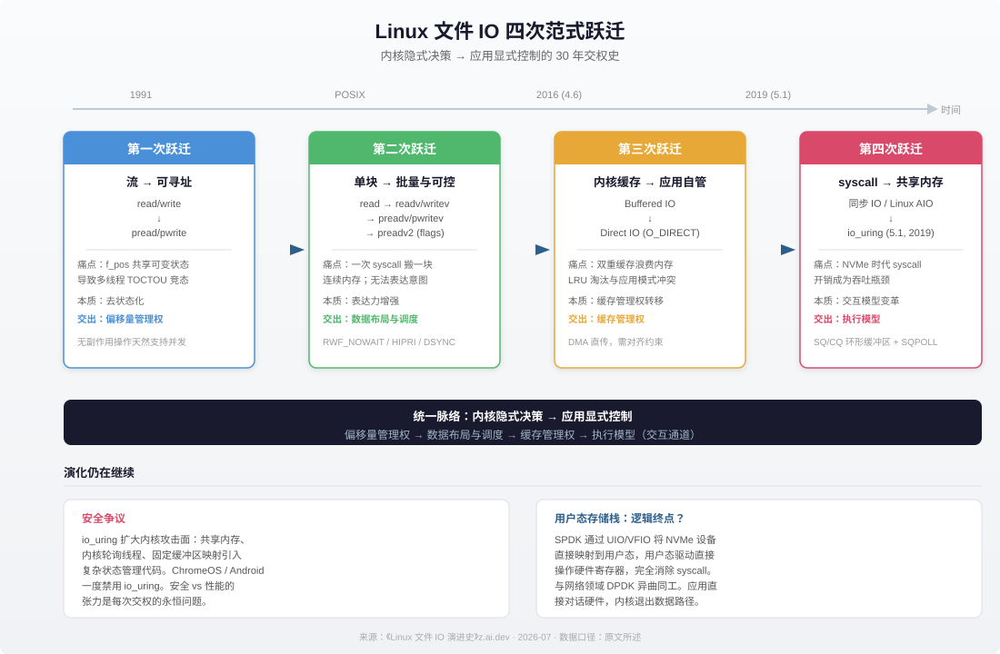

# Linux 文件 IO 演进史：从 read/write 到 io_uring 的四次范式跃迁

## 核心观点

这篇文章梳理了 Linux 文件 IO 从 1991 年到 2019 年的 30 年演进，将其归纳为**四次范式跃迁**。贯穿始终的统一逻辑是：**内核的每一个隐式决策——偏移量管理、缓存策略、IO 调度、执行时机——都在某个历史节点上被应用层的需求倒逼为"可选项"**。这是一部从"被内核代管"到"自主决策"的应用解放史。

文章的核心论点是：Linux IO 的演化不是技术炫技，而是应用规模增长的必然结果。当数据库引擎、网络服务器、分布式存储系统运行在文件系统之上时，内核为通用场景设计的每一个"好意的默认行为"都可能变成性能陷阱。内核因此不断开放新的控制接口，让"比内核更了解自身需求"的应用可以自行决策。

## 四次跃迁速览

| 跃迁 | 接口变化 | 应用痛点 | 内核交出的控制权 |
|---|---|---|---|
| 第一次 | read/write → pread/pwrite | 多线程并发随机读时 f_pos 共享可变状态导致 TOCTOU 竞态 | 偏移量管理权 |
| 第二次 | read → readv/preadv2 | 单次 syscall 只能搬一块连续内存；无法表达调度意图 | 数据布局与调度策略 |
| 第三次 | Buffered IO → O_DIRECT | 数据库双重缓存浪费内存；LRU 淘汰与应用访问模式冲突；持久性控制困难 | 缓存管理权 |
| 第四次 | 同步 syscall → io_uring | NVMe 时代 syscall 开销（~1μs/次）成为吞吐瓶颈；线程池模型低效 | 执行模型（交互通道） |

## 关键数据与细节

- **syscall 开销**：一次系统调用的用户态-内核态切换开销约 1 微秒；现代 NVMe SSD 随机读延迟约 10-20 微秒，IOPS 可达数十万至百万级。当单线程每秒百万次 IO 时，仅 syscall 开销就占满 1 秒。
- **pread 的设计精髓**：不仅是加了 offset 参数，更关键的是**不修改 f_pos**——这使 pread 成为无副作用操作，给定相同参数行为完全确定，天然支持并发。这是一种函数式设计思维。
- **preadv2 的三个 flag**：RWF_NOWAIT（cache miss 立即返回，适配协程调度）、RWF_HIPRI（轮询替代中断，降低延迟）、RWF_DSYNC（单次 IO 粒度的持久化控制，比 O_DSYNC 的文件级粒度更精细）。
- **O_DIRECT 的对齐要求**：缓冲区地址、IO 大小、文件偏移需按 512B 或 4KB 对齐。这不是内核刁难，而是绕过 Page Cache 后 DMA 硬件直接访问用户态内存的物理约束。
- **io_uring 的核心创新**：用共享内存的 SQ（提交队列）/CQ（完成队列）双环形缓冲区替代 syscall 作为用户态-内核态通信通道。SQPOLL 模式下可实现零 syscall 提交 IO。批量提交 100 个 IO 仅需 0-1 次 syscall。
- **Linux AIO（libaio）的失败**：只支持 O_DIRECT、io_submit 仍可能阻塞、只支持读写不支持 fsync 等操作、非 POSIX 标准接口。最终沦为小众接口。

## 值得注意的发现

1. **"去状态化"是反复出现的模式**。第一次跃迁把 f_pos 从内核内部状态变成调用参数；第四次跃迁把"每次 IO 一次 syscall"的同步交互变成无状态的队列生产-消费。内核隐式状态的消除是并发性能的关键。
2. **O_DIRECT 是逃逸舱口而非替代品**。文章明确指出 Page Cache 对绝大多数应用（脚本、命令行工具、静态文件服务）仍是"开箱即用的性能加速器"，O_DIRECT 只给"比内核更懂自己访问模式"的应用使用。
3. **io_uring 的安全争议未解决**。共享内存环形缓冲区和内核轮询线程显著扩大了内核攻击面，Google 的 ChromeOS 和 Android 一度禁用 io_uring。安全性和性能的张力是每次控制权转移的永恒问题。
4. **SPDK 是演化逻辑的终点**。如果说 io_uring 是把内核交互从 syscall 降为共享内存，那么 SPDK（Storage Performance Development Kit）通过 UIO/VFIO 把 NVMe 设备直接映射到用户态，连内核都绕过去了——应用直接与硬件对话。但这也意味着应用要自己处理安全隔离、资源共享、错误恢复等一切内核代劳的事。

## 关联实体

- [[io-uring|io_uring]] — 2019 年 Linux 5.1 引入的异步 IO 框架，作者 [[jens-axboe|Jens Axboe]]
- [[nvme|NVMe]] — 现代高速 SSD 接口标准，其百万级 IOPS 使 syscall 成为新瓶颈
- [[spdk|SPDK]] — 用户态存储性能开发套件，绕过内核直接操作 NVMe 硬件
- [[dpdk|DPDK]] — 网络领域的用户态数据面开发套件，与 SPDK 异曲同工
- [[linux-aio|Linux AIO (libaio)]] — 早期异步 IO 尝试，因局限性未被广泛采用

## 关联概念（待积累）

以下概念在本文中首次系统出现，待后续资料再次提及时建立概念页：

- **向量化 IO（scatter/gather）**：一次 syscall 搬运多块不连续内存
- **Buffered IO vs Direct IO**：内核 Page Cache 与应用自管缓存的路径选择
- **异步 IO 执行模型**：从同步阻塞到提交-完成分离的交互模式变革
- **Page Cache**：内核在用户与磁盘间的透明缓存层，包含热数据加速、写入合并、预读三大机制

## 来源

- 原文：`raw/2026-09-10-linux-file-io-evolution.md`
- 作者：z.ai.dev
- 发布：2026-07-26
- 链接：https://mp.weixin.qq.com/s/F4DSsGd6VGgW6xybDbrFog
